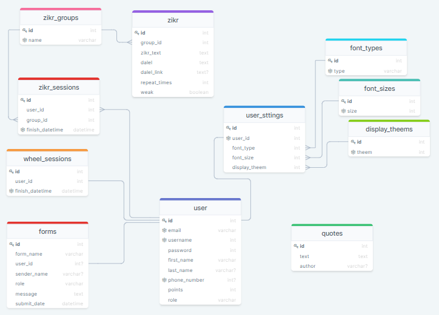

# DB Schema

- [User][]
- [User Settings][]
- [Progress][]
- [Zikr][]
- [Quote][]
- [Form][]

[User]: ./user.md
[User Settings]: ./user_settings.md
[Progress]: ./progress.md
[Zikr]: ./zikr.md
[Quote]: ./quote.md
[Form]: ./form.md
