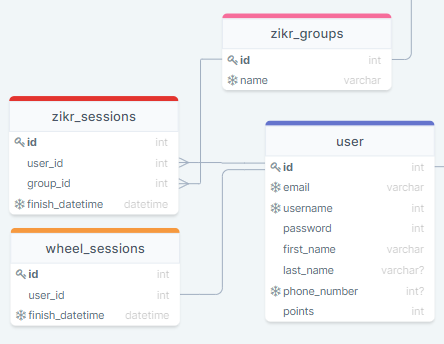

# Progress

## Sessions

### Zikr Sessions

| ATTRIBUTE | DATATYPE | DEFINITION |
| --- | --- | --- |
| id | INT | PK |
| user\_id | INT | A user\_id we use to refrence with the target user. useful for determining who finished the session. A user\_id is NOT UNIQUE, REQUIRED. |
| group\_id | INT |  A group\_id we use to refrence with the target zikr group. A group\_id is NOT UNIQUE, REQUIRED. |
| finish\_datetime | DATETIME | A finish\_datetime is the datetime when a user has finished a session. useful for updating progress everyday. A finish\_datetime is UNIQUE, REQUIRED. |

### Wheel Sessions

| ATTRIBUTE | DATATYPE | DEFINITION |
| --- | --- | --- |
| id | INT | PK |
| user\_id | INT | A user\_id we use to refrence with the target user. useful for determining who finished the session. A user\_id is NOT UNIQUE, REQUIRED. |
| finish\_datetime | DATETIME | A finish\_datetime is the datetime when a user has finished a session. useful for updating progress everyday. A finish\_datetime is UNIQUE, REQUIRED. |
