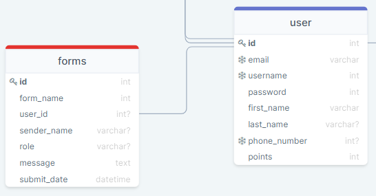

# Form

| ATTRIBUTE | DATATYPE | DEFINITION |
| --- | --- | --- |
| id | INT | PK |
| form\_name | STRING | A form\_name we use to group submissions of forms together. A form\_name is NOT UNIQUE, REQUIRED. |
| user\_id | INT | A user\_id we use to refrence with the target user who submitted the form. A user\_id is NOT UNIQUE, NOT REQUIRED. |
| sender\_name | STRING | A sender\_name of the submitter. A sender\_name is NOT UNIQUE, NOT REQUIRED. |
| role | STRING | A role is the purpose of the message. A role is NOT UNIQUE, REQUIRED. |
| message | STRING | A message is NOT UNIQUE, REQUIRED. |
| submit\_datetime | DATETIME | A submit\_datetime is the datetime when a user submitted the form. A submit\_datetime is UNIQUE, REQUIRED. |
