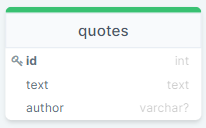

# Quote

| ATTRIBUTE | DATATYPE | DEFINITION |
| --- | --- | --- |
| id | INT | PK |
| text | STRING |  A text of quote. A text is NOT UNIQUE, REQUIRED |
| author | STRING | An author of quote. An author is NOT UNIQUE, NOT REQUIRED |
