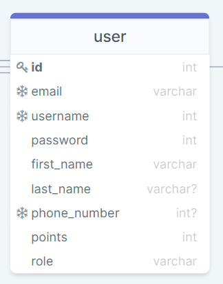

# user

| ATTRIBUTE | DATATYPE | DEFINITION |
| --- | --- | --- |
| id | INT | PK |
| email | STRING | An Email is the email that we use to communicate with the user and authentication An Email is UNIQUE, REQUIRED |
| username | STRING | A Username is UNIQUE, REQUIRED |
| password | STRING | A Password is the secret keyword of the user.A Password is used for user authentication.A Password is NOT UNIQUE, REQUIRED. |
| first\_name | STRING | first name of the owner of the account. useful for interaction with the user via emails.  NOT UNIQUE. REQUIRED. |
| last\_name | STRING | last name of the owner of the account. useful for interaction with the user via emails.  NOT UNIQUE. REQUIRED. |
| phone\_number | STRING | A phone\_number is the phone number the user used for communication with the user.A phone\_number is UNIQUE, NOT REQUIRED. |
| points | INT | Points are the number of points the user got while using the app. Points are NOT UNIQUE REQUIRED CHANGING|
