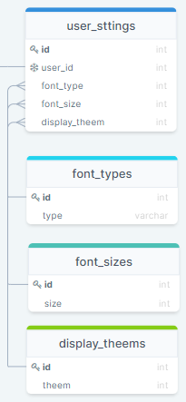

# user_settings

| ATTRIBUTE | DATATYPE | DEFINITION |
| --- | --- | --- |
| id | INT | PK |
| user\_id | INT | A user\_id we use to refrence with the target user. A user\_id is UNIQUE, REQUIRED |
| font\_type | INT | A font\_type is the font id used to refrence with the target font. A font\_type is NOT UNIQUE, REQUIRED |
| font\_type | INT | A font\_type is the font\_type id used to refrence with the target type. A font\_type is NOT UNIQUE, REQUIRED |
| font\_size | INT | A font\_size is the font\_size id used to refrence with the target size. A font\_size is NOT UNIQUE, REQUIRED |
| display\_theem | INT | A display\_theem is the display\_theem id used to refrence with the target theem. A display\_theem is NOT UNIQUE, REQUIRED |

## Joined Tables

### font\_types

| ATTRIBUTE | DATATYPE | DEFINITION |
| --- | --- | --- |
| id | INT | PK |
| type | STRING | Type of font. A type is UNIQUE, REQUIRED |

### font\_sizes

| ATTRIBUTE | DATATYPE | DEFINITION |
| --- | --- | --- |
| id | INT | PK |
| size | STRING | size of font. A size is UNIQUE, REQUIRED |

### display\_theems

| ATTRIBUTE | DATATYPE | DEFINITION |
| --- | --- | --- |
| id | INT | PK |
| theem | STRING | Theem of display. A theem is UNIQUE, REQUIRED |
