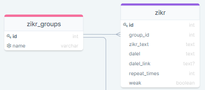

# zikr_model

## zikr

| ATTRIBUTE | DATATYPE | DEFINITION |
| --- | --- | --- |
| id | INT | PK |
| group\_id | INT | A group\_id we use to refrence with the target zikr group A group\_id is NOT UNIQUE, REQUIRED |
| zikr\_text | STRING | A zikr\_text is NOT UNIQUE, REQUIRED |
| repeat\_times | INT | A repeat\_times is the number of times to repeat zikr. A repeat\_times is NOT UNIQUE, REQUIRED. |
| dalel | STRING | A dalel is the hadith of the prophet of zikr. A dalel is NOT UNIQUE, REQUIRED. |
| dalel\_link | STRING | A dalel\_link is where we got dalel. Useful for knowing the source of the dalel. A dalel\_link is NOT UNIQUE, NOT REQUIRED. |
| weak | Boolean | Weak is used to indicate the level of authentication of the dalel. Weak is NOT UNIQUE, REQUIRED. |

## zikr_group

| ATTRIBUTE | DATATYPE | DEFINITION |
| --- | --- | --- |
| id | INT | PK |
| name | INT | Name of zikr group. A name is UNIQUE, REQUIRED |
